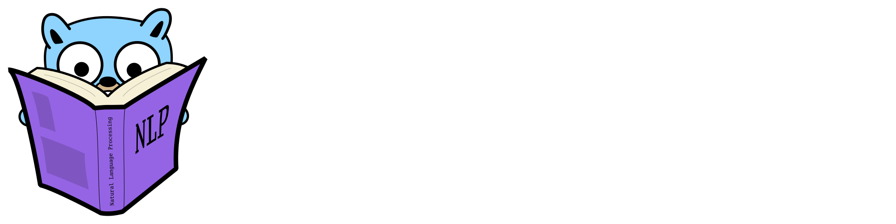

# Jinn

Jinn is a collection of NLP related packages for the Go ecosystem. Jinn is not NLTK. 

## Packages

| Package      | Description                | Documentation                                                               |
|--------------|----------------------------|-----------------------------------------------------------------------------|
| `corenlp`    | Simple CoreNLP[^1] wrapper | [pkg/corenlp](https://pkg.go.dev/github.com/jonasknobloch/jinn/pkg/corenlp) |
| `msrpc`      | MSRPC[^2] sample iterator  | [pkg/msrpc](https://pkg.go.dev/github.com/jonasknobloch/jinn/pkg/msrpc)     |
| `tree`       | Basic tree implementation  | [pkg/tree](https://pkg.go.dev/github.com/jonasknobloch/jinn/pkg/tree)       |

[^1]: [The Stanford CoreNLP Natural Language Processing Toolkit](https://nlp.stanford.edu/pubs/StanfordCoreNlp2014.pdf)
[^2]: [Automatically Constructing a Corpus of Sentential Paraphrases](https://www.microsoft.com/en-us/research/wp-content/uploads/2016/02/I05-50025B15D.pdf)
